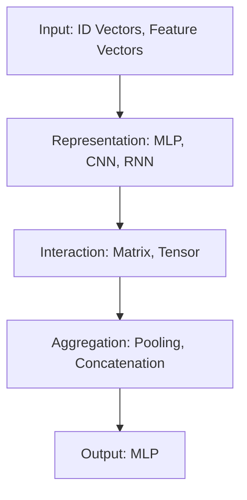

refer:

...

### Matching

#### Matching vs  Classification/Regression/Ranking

+ Matching vs Classification and Regression

  Matching can be viewed as special case of classification and regression, but features need to be carefully designed to represent the interactions between inputs. (匹配相对于分类、回归而言，它需要更多输入特征之间的交互)

+ Matching and Ranking

  In search and recommendation:
  Matching models can be features of ranking model. Sometimes, matching model and ranking model are combined and trained together with pairwise loss.

#### Matching in Search/Recommendation/Paraphrasing/QA

+ Search

  Text matching: query-title matching

  Lexical matching is more important

  **Asymmetric matching**: query to title (document)

  Query term importance may need to be considered

+ Recommendation

  Entity matching: user-item matching
  Interactions (similarities) between entities are useful information
  Data is sparse
  Hidden structure of interactions (obtained via matrix factorization) is powerful.

+ Paraphrasing

  Text matching: sentence-sentence matching
  Semantic matching is more important

  **Symmetric matching**: text to text

+ QA

  Text matching: question-answer matching
  Semantic matching is more important

  **Asymmetric matching**: question to answer

### Framework and Principles of Matching

#### Framework

Most of matching model following this framework. Such as model without the representation layer, model with $1^{st}$ order and $2^{nd}$ order feature interaction (factorization machine) in interaction layer.

#### Principles

+ Modular Principle: System consists of different modules (functions) implemented with different techniques
  – Representation: CNN, RNN, MLP
  – Interaction: matrix, tensor
  – Aggregation: pooling, concatenation
+ Hybrid Principle: Combination of dichotomic techniques may be necessary
  – Deep model and wide model
  – Nonlinear model and linear model
  – Factorization and non-factorization (2nd order interaction and 1st order interaction)

#### Ablation Analysis

Why need this modular or what's the effect of this modular, such as MLP layer?

### State-of-the-Art Techniques for Matching

#### Models

##### DSSM (Search)

Huang at al. CIKM 2013

##### Arc II (QA)

Hu at al. NIPS 2014

##### DRMM (Search)

Guo at al. CIKM 2016

Attention: query term weighting

##### NeuMF (Recommendation)

He at al. WWW 2017

Representation: Two vectors (embeddings) for factorization and for neural network respectively

Interaction: Two vectors obtained by factorization machine and neural network

##### DeepFM (Recommendation)

Guo at al. IJCAI 2017

Representation: Two shared vectors (embeddings) for factorization machine and neural network

Interaction: Two vectors obtained by factorization machine and neural network

##### NFM (Recommendation)

He at al. SIGIR 2017

Representation: Vector (embedding) from combined vectors

Interaction: Vector by factorization machine plus neural network, as well as values by linear model

#### Assumption Analysis

What's the preference of each match models?

